# Enunciado: Automatización CI/CD con Jenkinsfile sobre el proyecto backend

El objetivo de este ejercicio es definir un flujo CI/CD para una aplicación Node.js aplicando buenas prácticas. Para ello:

- Se utilizará el código fuente ubicado en el directorio backend. Este contenido deberá subirse a un repositorio público de GitHub, de modo que Jenkins pueda acceder a él mediante su URL HTTP.
- Se creará un fichero Jenkinsfile en el repositorio, donde se definirá el flujo de CI/CD.
- El objetivo final es crear en Jenkins un proyecto MultiBranch que utilice como origen el repositorio de GitHub creado.

El Jenkinsfile debe cubrir los siguientes requisitos:

## Parte obligatoria

0. **Levantar el entorno Jenkins con Docker**

Antes de nada, necesitamos un Jenkins funcionando. El ejercicio ya proporciona un `Dockerfile` y un `compose.yaml` que levantan Jenkins con Node.js, Docker CLI y Docker Compose preinstalados.

Abro el terminal en la carpeta raíz del proyecto y ejecuto `docker compose up -d --build` para construir la imagen y levantar Jenkins.

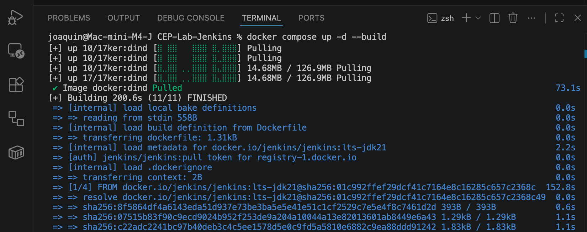

Accedo a `http://localhost:8080` y completo el setup inicial de Jenkins

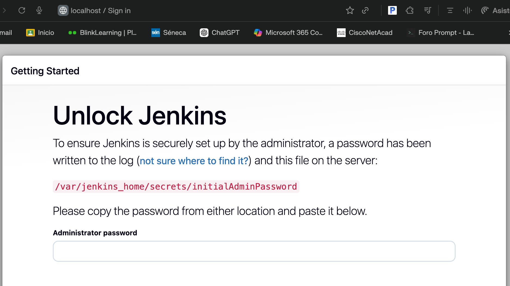

Obtengo la contraseña inicial con `docker exec jenkins cat /var/jenkins_home/secrets/initialAdminPassword`. Introduzco esa contraseña en la casilla de contraseña de Administrador (en la web) y continuo

Instalo los plugins sugeridos.

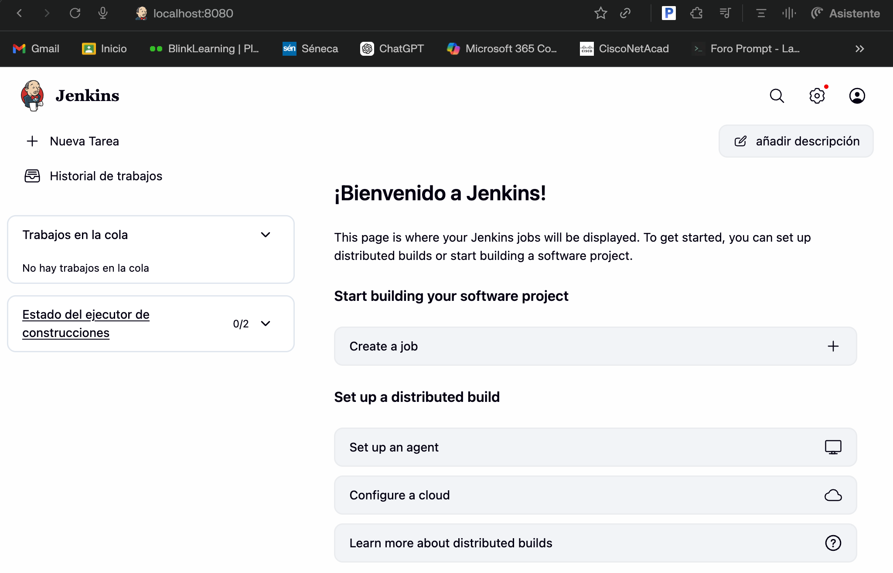

El contenido del directorio `backend/` lo subo a un **repositorio público de GitHub**.

---

Se crea un archivo Jenkinsfile dentro del repositorio de GitHub que contiene las instrucciones para ejecutar el pipeline. Es necesario que este archivo esté en la raíz del proyecto.
Utilizo el archivo proporcionado en el enunciado para la tarea y compruebo que cumple con todas las opciones que se están pidiendo para cada uno de los puntos.

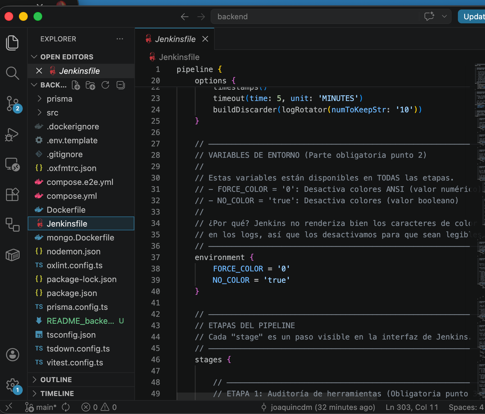

1. **Opciones del Job**
   - El job debe estar configurado mediante la directiva `options` con los siguientes elementos:
     - Deshabilitar builds concurrentes.
     - Mostrar marcas de tiempo.
     - Timeout de 5 minutos.

2. **Variables de entorno**
   - El job debe definir las siguientes variables de entorno que heredarán todas las etapas:
     - `FORCE_COLOR`: Tendrá el valor numérico `0`.
     - `NO_COLOR`: Tendrá el valor booleano `true`.

3. **Auditoría de herramientas**
   - Incluye una etapa "Audit tools" que imprima por pantalla la versión de node con `node --version`.

4. **Instalación de dependencias**
   - Incluye una etapa "Install dependencies" que instale las dependencias del proyecto con `npm install`.

5. **Creación de ficheros autogenerados**
   - Incluye una etapa "Generate files" que cree los ficheros autogenerados que necesita el proyecto con `npm run prisma:generate`.

6. **Chequeo de formato de código**
   - Incluye una etapa "Format check" que verifique el formato del código usando `npm run format:check`.

7. **Chequeo de calidad de código**
   - Incluye una etapa "Code quality" que verifique la calidad del código usando `npm run lint`.

8. **Chequeo de tipos**
   - Implementa una etapa "Type check" que ejecute la comprobación de tipos con `npm run type-check`.

9. **Ejecución de tests**
   - Implementa una etapa "Tests" que ejecute los tests usando `npm run test`.

10. **Construcción y archivado**

- Implementa una etapa "Build" que construya la solución usando `npm run build`.
- Esta etapa deberá de archivar los artefactos del directorio `dist/`. El _fingerprint_ deberá estar activo.
- Verifica que los artefactos son visibles. Deberás de ver dentro del job el archivo `server.mjs`.

11. **Etapas finales**
    - Configura que cuando el job finalice exitosamente muestre por pantalla: `'Pipeline completed successfully!'`.
    - Configura que cuando el job finalice con errores muestre por pantalla: `'Pipeline failed. Review logs.'`.
    - Configura que cuando el job finalice, sin importar cómo, siempre limpie el workspace.

## Crear el proyecto MultiBranch en Jenkins

Desde el navegador acceso a Jenkins en localhost. Hago clic en "New Item" en la esquina superior izquierda.
Le doy un nombre: tarea-jenkins-backend y selecciono la opción "Multibranch Pipeline" (Pipeline multirrama). Hago clic en el botón "OK" al final de la página.

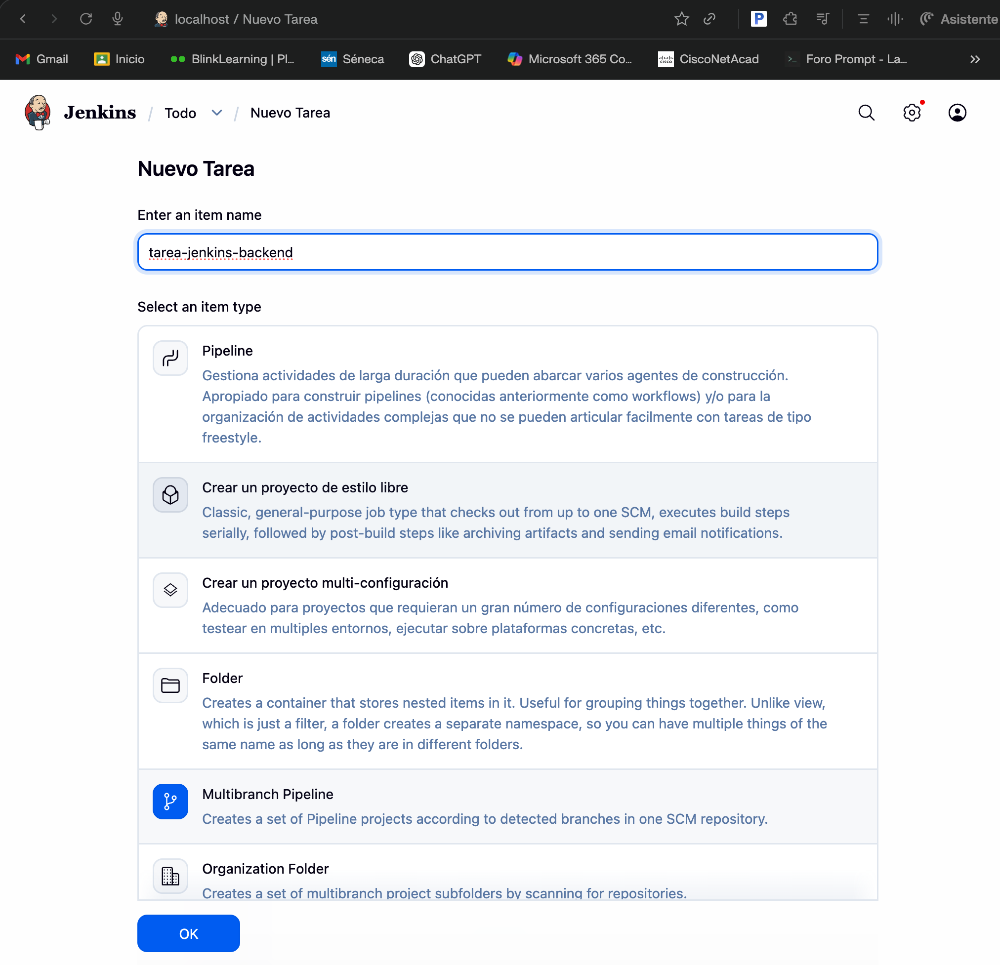

En la pantalla de configuración que se abre, voy a la sección "Branch Sources".
Hago clic en el botón "Add source" y selecciono "Git".
En el campo "Project Repository", pego la URL HTTPS de mi repositorio de GitHub. Las credenciales no las pongo porque es un repositorio público.

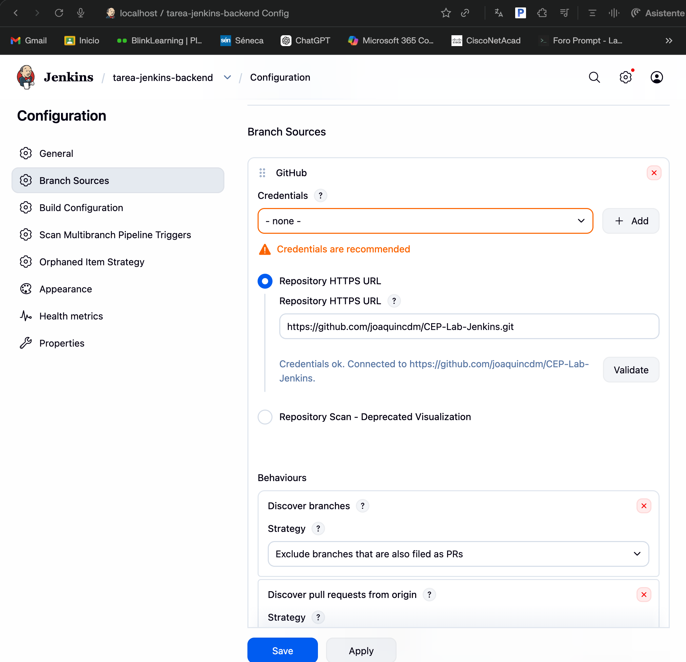

Se puede observar el primer escaneo y ejecución, en el que Jenkins detecta el Jenkinsfile y comienza a ejecutar las etapas definidas en él.

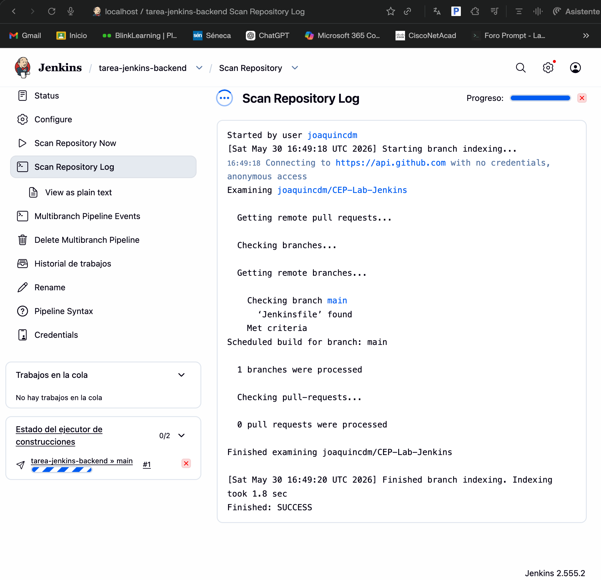

El escaneo se puede ver que ha ido bien. Ahora voy a comprobar que se ha creado la rama en Jenkins y que puedo ver el Stage View de la rama.

En el Stage View se puede ver que todas las etapas se han ejecutado correctamente, excepto la etapa de "Test" que ha fallado. 

Intengo averiguar qué es lo que falla examinando la salida de la consola.

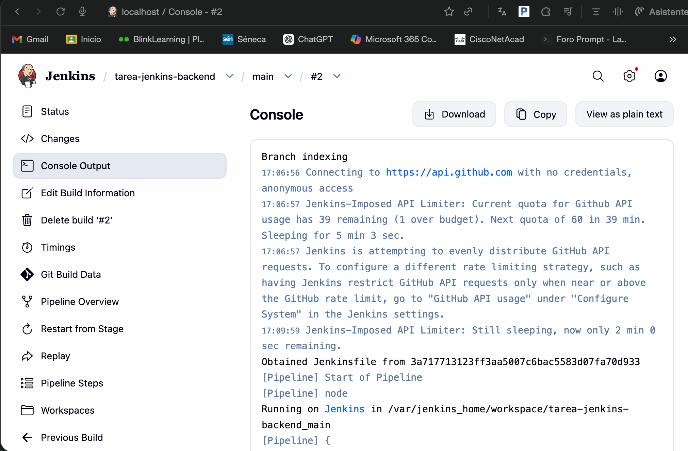

Busco la causa del error.

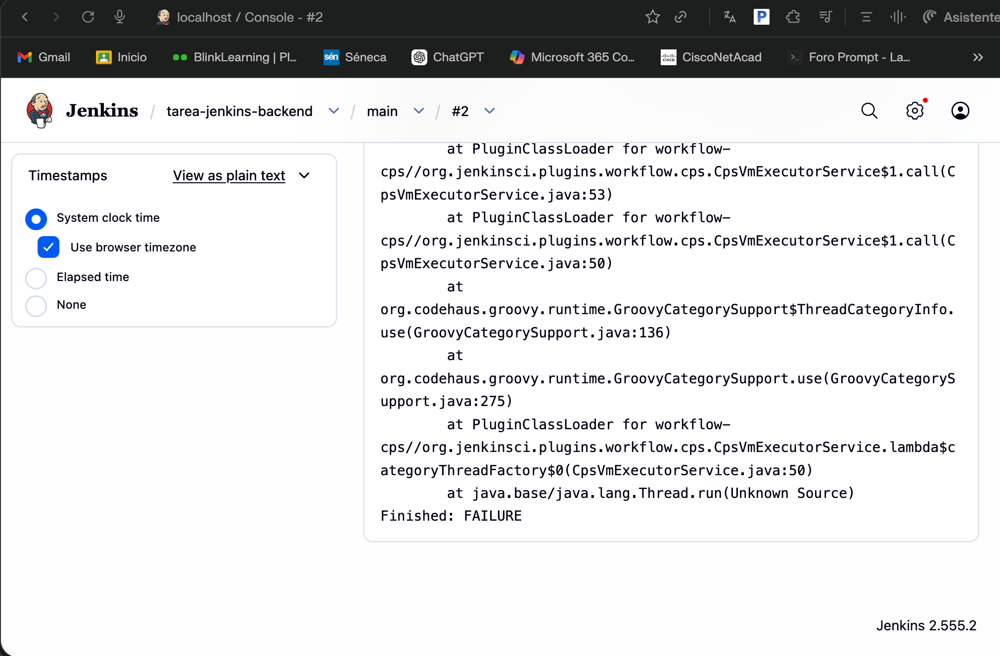

El error encontrado es: java.lang.NoSuchMethodError: No such DSL method 'publishHTML' found

Esto significa que Jenkins no encuentra la instrucción publishHTML porque el plugin HTML Publisher Plugin no está instalado en mi Jenkins local.

Voy a la configuración e instalo el plugin HTML Publisher.

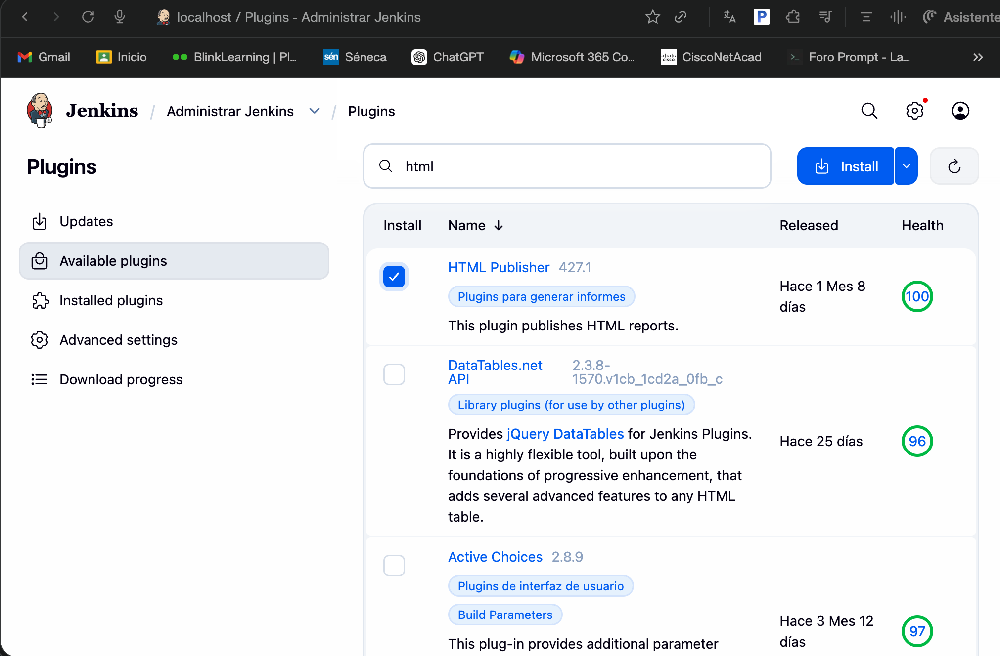

Con el plugin HTML Publisher instalado aparece una nueva opción "Coverage Report" que muestra información visual.

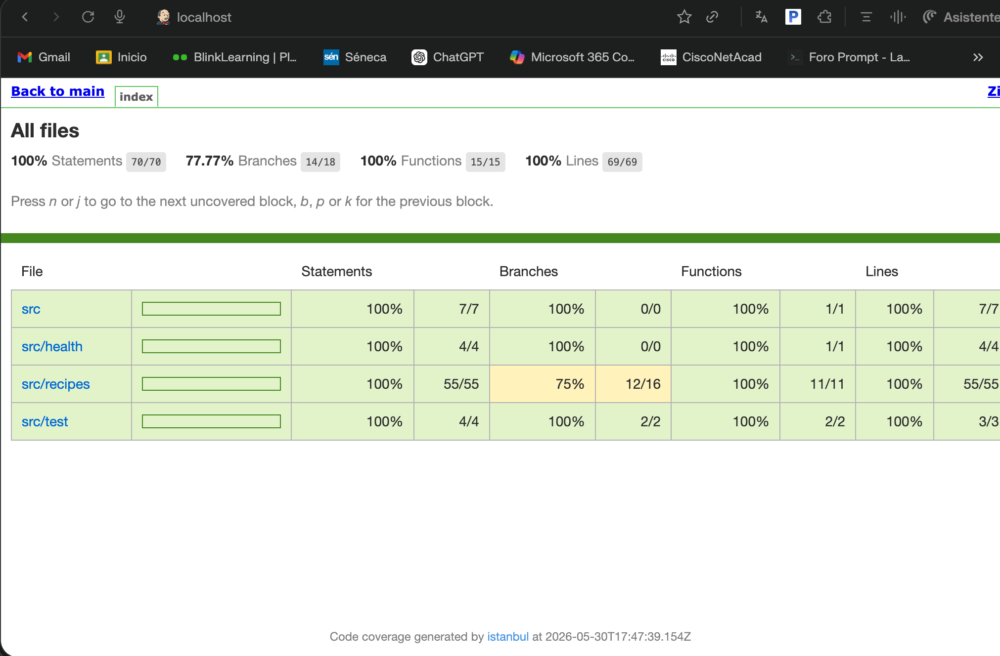

Vuelvo a ejecutar y se corrije el problema anterior pero me vuelve a salir un error.

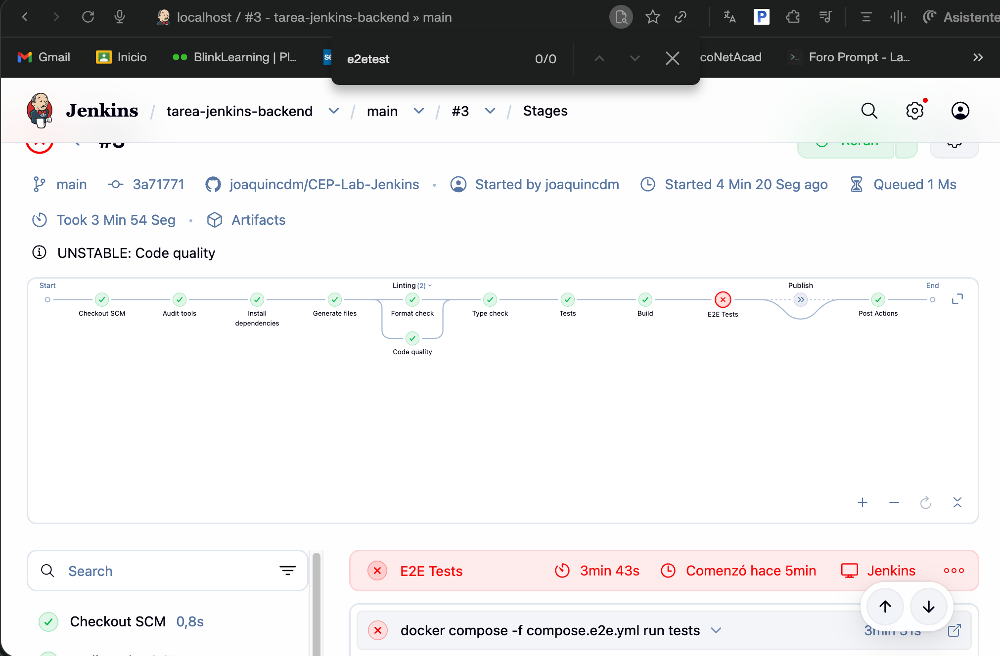

Modifico el archivo compose.e2e.yml para arreglar el error.

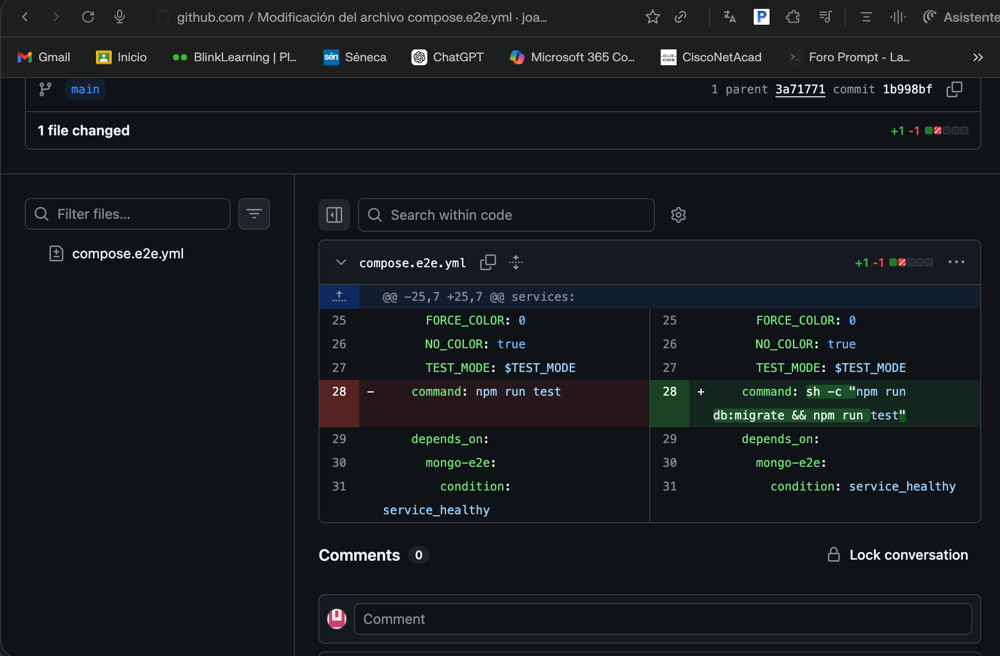

Vuelvo a ver el Stage View (la vista de etapas) donde cada uno de los bloques que definimos en el Jenkinsfile (Audit tools, Install dependencies, etc.) se irá ejecutando e iluminando de color verde. Esta vez sí ha ido bien.

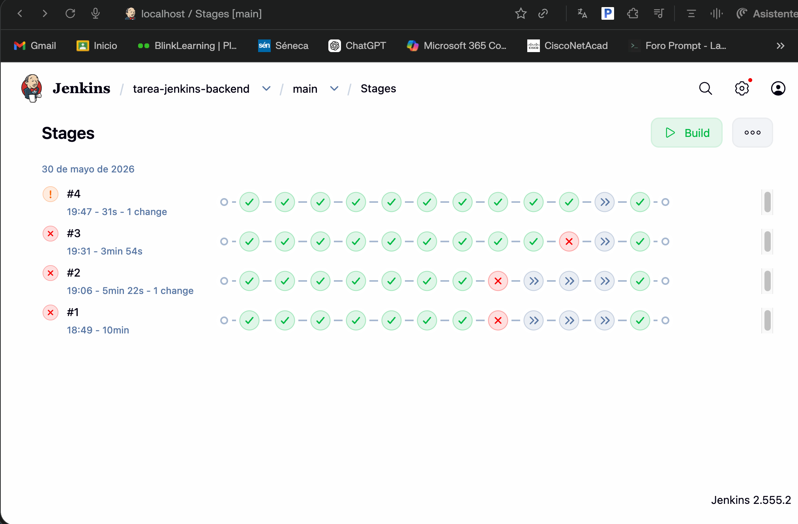

También puedo ver los artefactos descargables de la ejecución anterior:

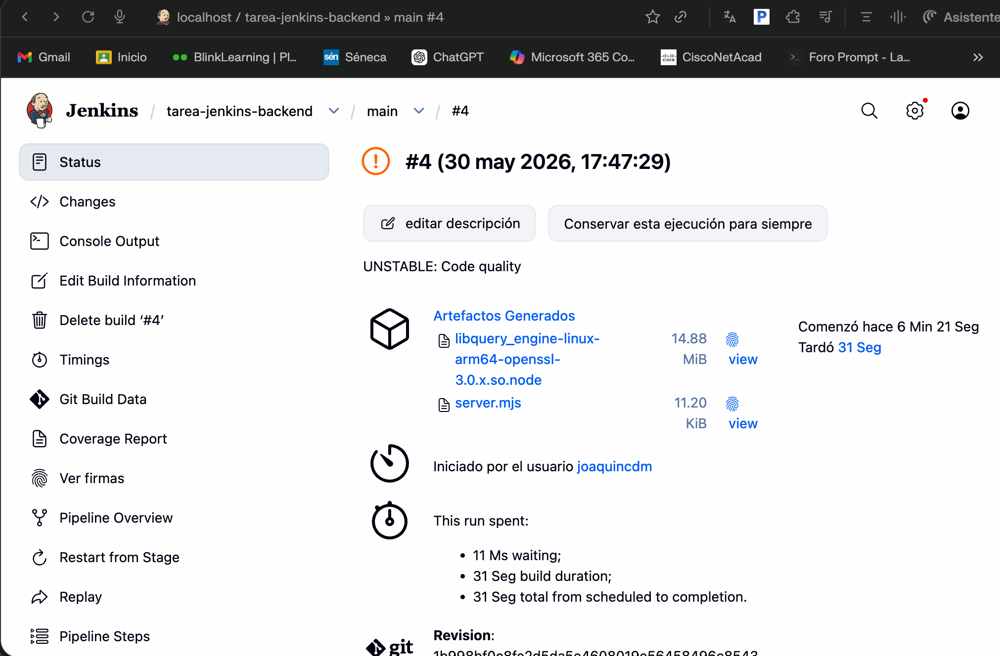

